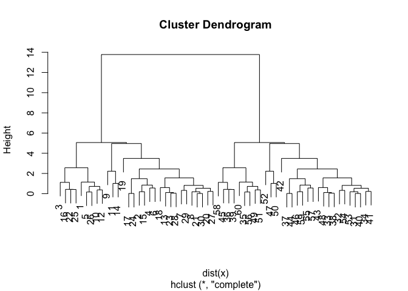

# Class 07: machine Learning 1
Pranati

Today we will start out multi-part exploration of some key machine
learning methods. We will begin with clustering - finding groupings in
data, and then dimensionallity reduction.

## Clustering

Let’s start with “k-means” clustering. The main function in base R for
this `kmeans()`.

``` r
# Make up some data
hist(rnorm(100000, mean=3))
```


``` r
tmp <- c(rnorm(30, -3), rnorm (30, +3))
x <- cbind(x=tmp, y=rev(tmp))
plot(x)
```


Now let’s try out `kmeans()`

``` r
km <- kmeans(x, centers=2)
km
```

    K-means clustering with 2 clusters of sizes 30, 30

    Cluster means:
              x         y
    1 -2.774620  3.107505
    2  3.107505 -2.774620

    Clustering vector:
     [1] 1 1 1 1 1 1 1 1 1 1 1 1 1 1 1 1 1 1 1 1 1 1 1 1 1 1 1 1 1 1 2 2 2 2 2 2 2 2
    [39] 2 2 2 2 2 2 2 2 2 2 2 2 2 2 2 2 2 2 2 2 2 2

    Within cluster sum of squares by cluster:
    [1] 67.63627 67.63627
     (between_SS / total_SS =  88.5 %)

    Available components:

    [1] "cluster"      "centers"      "totss"        "withinss"     "tot.withinss"
    [6] "betweenss"    "size"         "iter"         "ifault"      

> Q. How many points in each cluster?

``` r
km$size
```

    [1] 30 30

> Q. What component of your result object details cluster
> assignment/membership?

``` r
km$cluster
```

     [1] 1 1 1 1 1 1 1 1 1 1 1 1 1 1 1 1 1 1 1 1 1 1 1 1 1 1 1 1 1 1 2 2 2 2 2 2 2 2
    [39] 2 2 2 2 2 2 2 2 2 2 2 2 2 2 2 2 2 2 2 2 2 2

> Q. What are centers/mean values of each cluster?

``` r
km$centers
```

              x         y
    1 -2.774620  3.107505
    2  3.107505 -2.774620

> Q. Make a plot of your data showing your clustering results
> (groupings/clusters and cluster centers).

``` r
plot(x, col = c(1, 2))
```


``` r
plot(x, col=km$cluster)
points(km$centers, col="green", pch=15, cex=3)
```


> Q. Run `kmeans()` again and cluster in 4 groups and plot the results.

``` r
km4 <- kmeans(x, centers=4)
km4
```

    K-means clustering with 4 clusters of sizes 1, 14, 15, 30

    Cluster means:
              x         y
    1  3.792916 -5.947925
    2  2.105134 -2.548065
    3  3.997357 -2.774518
    4 -2.774620  3.107505

    Clustering vector:
     [1] 4 4 4 4 4 4 4 4 4 4 4 4 4 4 4 4 4 4 4 4 4 4 4 4 4 4 4 4 4 4 3 3 3 3 2 2 2 3
    [39] 2 3 3 1 3 2 2 2 3 3 2 3 3 3 3 3 2 2 2 2 2 2

    Within cluster sum of squares by cluster:
    [1]  0.00000 16.26320 14.17081 67.63627
     (between_SS / total_SS =  91.6 %)

    Available components:

    [1] "cluster"      "centers"      "totss"        "withinss"     "tot.withinss"
    [6] "betweenss"    "size"         "iter"         "ifault"      

``` r
plot(x, col=km4$cluster)
```


## Hierarchical Clustering

This form of clustering aims to reveal the structure in your data by
progressivey grouping points into a ever smaller number of clusters.

The main function in base R for this called `hclust()`. This function
does not take our input data directly but wants a “distance matrix” that
details how (dis)similar all our input points are to each other.

``` r
dist(x)
```

                 1           2           3           4           5           6
    2   2.20018589                                                            
    3   1.42616473  1.59567449                                                
    4   2.00048819  0.47987682  1.15354971                                    
    5   1.14875046  1.12723586  0.75227890  0.85483359                        
    6   1.54442888  0.65695472  1.14579040  0.56173735  0.50391480            
    7   2.22267360  1.06689653  2.29322120  1.45428909  1.58139275  1.15291028
    8   1.83427672  0.82594102  1.84589499  1.10638397  1.12765159  0.71711670
    9   1.80279683  2.84639557  3.00202963  2.95870789  2.37178382  2.40060057
    10  1.05044873  1.30232064  1.44674177  1.29188071  0.72014998  0.73133002
    11  3.44187881  2.82751213  3.97682414  3.23243643  3.22763705  2.88421797
    12  0.78814053  1.41924378  1.13572026  1.27543544  0.49918450  0.76974462
    13  2.65610868  1.11523890  2.56597117  1.57670288  1.90563389  1.42735497
    14  2.81168194  2.90899895  3.67038116  3.20618451  2.93221008  2.73121221
    15  2.39129906  0.19364342  1.76501901  0.62246433  1.32017191  0.84955413
    16  2.25011574  2.05087046  0.86546721  1.57269303  1.55983492  1.82410922
    17  2.85236538  1.07798864  1.70268658  0.91159684  1.71104216  1.47166268
    18  3.16248489  1.48413781  3.01943115  1.96334273  2.38914038  1.89847706
    19  4.98077595  2.85242034  4.38079522  3.23442942  3.97712300  3.48701760
    20  1.60654295  1.09760330  1.84789260  1.29821324  1.09821084  0.80868182
    21  1.84029164  0.66519143  1.72811406  0.93949559  1.03418207  0.58492849
    22  2.37749923  2.45579539  1.11816821  1.97613356  1.86167968  2.18248227
    23  2.59826133  1.15124004  2.56057822  1.60208024  1.88454873  1.41679494
    24  2.86738681  1.08058329  1.72119871  0.92240923  1.72533787  1.48181428
    25  1.96437705  2.19953774  0.73256121  1.72365744  1.48472429  1.84857165
    26  0.98586161  1.27460981  0.77623635  1.01760552  0.16308211  0.63318713
    27  1.79707157  1.17487724  2.06185909  1.43988812  1.31468224  0.99168493
    28  2.56079207  1.10954527  2.51514458  1.55844990  1.83989978  1.37145360
    29  2.20965237  1.37311235  2.47240581  1.73042462  1.73355755  1.36165304
    30  1.84249278  0.64671593  1.71544877  0.92035542  1.02508284  0.57127049
    31  7.10290317  8.65034555  7.05473521  8.20020909  7.64254469  8.13502495
    32  7.62709191  9.28184850  7.69040767  8.84229580  8.24384761  8.74241128
    33  7.90154173  9.46513426  7.86953815  9.01501325  8.45541483  8.94854758
    34  7.20009565  8.84591508  7.25435348  8.40621163  7.80910048  8.30737480
    35  5.99634777  7.54620081  5.95112298  7.09916247  6.53217790  7.02559637
    36  5.18764568  6.42584132  4.84529611  5.95806057  5.50489420  5.97311954
    37  7.18118942  8.34943449  6.78957234  7.87489728  7.47085579  7.92828683
    38  7.94367990  9.50963562  7.91405737  9.05967495  8.49932726  8.99259656
    39  5.17655750  6.28221819  4.72135882  5.80857186  5.40729446  5.86115603
    40  7.10790607  8.65898132  7.06340692  8.20918876  7.65008281  8.14280416
    41  6.99224022  8.62758976  7.03554305  8.18713113  7.59305208  8.09087489
    42  9.98199521 11.24580312  9.67769695 10.77261244 10.34559232 10.81118331
    43  8.48033957 10.00542048  8.41007027  9.55071704  9.00981508  9.49998952
    44  7.16186144  8.33096323  6.77085966  7.85647818  7.45193792  7.90949010
    45  5.54462279  6.69428845  5.12868177  6.22153016  5.80814403  6.26614104
    46  7.35629130  8.75026163  7.16069301  8.28703392  7.79321525  8.27342859
    47  8.05998655  9.93416609  8.38157069  9.52826706  8.84004238  9.34387706
    48  7.98174953  9.53045841  7.93478404  9.07874540  8.52566634  9.01775518
    49  6.07323136  7.70433580  6.11356233  7.26591871  6.66712629  7.16519729
    50  8.83646656 10.61765467  9.04035916 10.19353268  9.54747441 10.05048806
    51  6.42430568  8.07551830  6.48575753  7.63846397  7.03421687  7.53309836
    52  6.81030492  8.73519283  7.20635928  8.34328317  7.62871322  8.13145796
    53  7.15756758  8.73915721  7.14420359  8.29234655  7.72115960  8.21582164
    54  7.59175209  9.19041935  7.59577564  8.74451092  8.16888528  8.66437724
    55  6.60915518  8.10754696  6.51204473  7.65398555  7.11264620  7.60200377
    56  6.10642138  7.62548030  6.02983630  7.17512634  6.62138659  7.11264620
    57  6.75565124  8.12837911  6.53942656  7.66481413  7.17512634  7.65398555
    58  5.60344987  6.99860708  5.40566569  6.53942656  6.02983630  6.51204473
    59  7.17656920  8.58993631  6.99860708  8.12837911  7.62548030  8.10754696
    60  5.43220878  7.17656920  5.60344987  6.75565124  6.10642138  6.60915518
                 7           8           9          10          11          12
    2                                                                         
    3                                                                         
    4                                                                         
    5                                                                         
    6                                                                         
    7                                                                         
    8   0.45394571                                                            
    9   2.10921799  2.05603683                                                
    10  1.17890423  0.78528135  1.69282144                                    
    11  1.77814837  2.17037817  2.22350268  2.60805773                        
    12  1.51858605  1.09236112  1.88879891  0.37566977  2.98181928            
    13  0.45962482  0.83026658  2.52496859  1.60597629  1.78187860  1.92256518
    14  1.87949858  2.10605978  1.28448453  2.22375569  1.01801681  2.55949438
    15  1.09462687  0.92936265  2.97710269  1.47581029  2.81687369  1.60843547
    16  2.95739777  2.53885601  3.86713053  2.27816867  4.70823202  1.99227563
    17  2.12903475  1.89721946  3.85631971  2.20283086  3.84740034  2.17119727
    18  0.95124198  1.33630088  2.91460921  2.11259143  1.74374842  2.42809523
    19  2.92602930  3.19217816  4.96467306  3.96020263  3.45972132  4.19593415
    20  0.61636399  0.31329229  1.75522357  0.56851481  2.12946910  0.92611588
    21  0.56827198  0.16869201  2.19518550  0.80907115  2.32108203  1.07194236
    22  3.32925089  2.89955847  4.08179581  2.56484301  5.06107485  2.24755406
    23  0.38310040  0.78619590  2.42685607  1.55006952  1.71278190  1.87643701
    24  2.12920923  1.90114228  3.86443568  2.21309232  3.84444932  2.18410378
    25  3.00147609  2.56092541  3.66741531  2.17323743  4.70586832  1.84517320
    26  1.64570323  1.19318766  2.27014895  0.67118589  3.24147980  0.38147073
    27  0.45135988  0.34942575  1.74137474  0.77719444  1.91523652  1.14226569
    28  0.35224794  0.74448739  2.41632865  1.51181283  1.74697617  1.83567996
    29  0.32379041  0.64707832  1.85117185  1.20998027  1.52336604  1.57779162
    30  0.58284385  0.18816683  2.21179367  0.81452325  2.33841563  1.07178683
    31  9.18526227  8.73873027  8.58310619  8.04474361 10.54004848  7.67955723
    32  9.76040187  9.31987428  9.01750615  8.60254163 11.04250987  8.24478969
    33  9.99519164  9.54942620  9.35457102  8.85134920 11.33466285  8.48738181
    34  9.32795063  8.88679902  8.60717852  8.17164680 10.61998094  7.81300955
    35  8.07342581  7.62702217  7.50243640  6.93339507  9.43578284  6.56788274
    36  7.08341107  6.62965298  6.86615060  6.00858941  8.59595594  5.63329100
    37  9.05206455  8.59815040  8.84820028  7.99397320 10.58674428  7.61835959
    38 10.03860821  9.59295975  9.39427180  8.89433877 11.37633917  8.53052787
    39  6.98866734  6.53493658  6.89677250  5.94647022  8.54842284  5.57093355
    40  9.19204550  8.74568062  8.58558565  8.05089182 10.54464957  7.68591323
    41  9.11466288  8.67283417  8.41237908  7.96003592 10.41559184  7.60051334
    42 11.92435842 11.47060220 11.57680975 10.84188995 13.41417967 10.46736605
    43 10.55779478 10.11026289  9.94935410  9.42035679 11.91707703  9.05437718
    44  9.03313439  8.57921780  8.82883786  7.97482832 10.56751852  7.59921719
    45  7.38938428  6.93547968  7.24488147  6.33609371  8.93359971  5.96042412
    46  9.36060139  8.90885726  8.92186860  8.24965814 10.79664740  7.87787760
    47 10.26749423  9.84828201  9.22201619  9.08920612 11.36266692  8.75604942
    48 10.06866463  9.62218858  9.44351920  8.92733092 11.41670566  8.56251524
    49  8.18910120  7.74694853  7.52126976  7.03585229  9.50201488  6.67554858
    50 11.02004587 10.59021076 10.08738571  9.84707771 12.19331110  9.50201488
    51  8.55095396  8.11007825  7.84700880  7.39446190  9.84707771  7.03585229
    52  9.02590336  8.61327443  7.93971264  7.84700880 10.08738571  7.52126976
    53  9.25642382  8.81155428  8.61327443  8.11007825 10.59021076  7.74694853
    54  9.70036756  9.25642382  9.02590336  8.55095396 11.02004587  8.18910120
    55  8.66437724  8.21582164  8.13145796  7.53309836 10.05048806  7.16519729
    56  8.16888528  7.72115960  7.62871322  7.03421687  9.54747441  6.66712629
    57  8.74451092  8.29234655  8.34328317  7.63846397 10.19353268  7.26591871
    58  7.59577564  7.14420359  7.20635928  6.48575753  9.04035916  6.11356233
    59  9.19041935  8.73915721  8.73519283  8.07551830 10.61765467  7.70433580
    60  7.59175209  7.15756758  6.81030492  6.42430568  8.83646656  6.07323136
                13          14          15          16          17          18
    2                                                                         
    3                                                                         
    4                                                                         
    5                                                                         
    6                                                                         
    7                                                                         
    8                                                                         
    9                                                                         
    10                                                                        
    11                                                                        
    12                                                                        
    13                                                                        
    14  2.11653494                                                            
    15  1.06110680  2.96588488                                                
    16  3.14207669  4.48947683  2.17000707                                    
    17  2.07297648  3.98660629  1.03784537  1.64383116                        
    18  0.50684149  2.30942311  1.37748170  3.53493758  2.29370915            
    19  2.47212631  4.26248132  2.66183141  4.55157304  2.91996219  2.05022639
    20  1.06002595  1.92382263  1.22191335  2.60763840  2.14541081  1.56270369
    21  0.87666378  2.27475089  0.78202993  2.39433764  1.73149848  1.37250017
    22  3.53545715  4.78829336  2.58092093  0.41834574  2.04986991  3.93939766
    23  0.10104021  2.02012240  1.11252886  3.15924113  2.13557473  0.56841750
    24  2.06896673  3.98863945  1.03698309  1.66272832  0.01936732  2.28583177
    25  3.24154379  4.39625012  2.34408824  0.42539851  1.97433718  3.67009635
    26  1.99523945  2.89486980  1.46815448  1.61992567  1.87138204  2.48713669
    27  0.91045467  1.76631271  1.27085154  2.80747152  2.24648627  1.40045343
    28  0.11065506  2.03465342  1.07453273  3.11454601  2.10051588  0.60302183
    29  0.67448340  1.55610822  1.41344585  3.18520000  2.44372530  1.09127329
    30  0.88346204  2.29422337  0.76531044  2.37813476  1.71230287  1.37745440
    31  9.54583984  9.81075516  8.81825812  6.82685415  8.47061232 10.03145557
    32 10.13730999 10.26946596  9.45501016  7.51801604  9.16010354 10.63026840
    33 10.35802042 10.59159763  9.63309118  7.63718183  9.28067523 10.84448229
    34  9.70349247  9.85469021  9.01898565  7.08420288  8.72587093 10.19596064
    35  8.43483409  8.71924147  7.71571070  5.75055370  7.39364474  8.92126615
    36  7.40042539  7.99385026  6.58051304  4.49916809  6.13290157  7.86375407
    37  9.35428181  9.98625468  8.49520338  6.36297592  7.96212859  9.80692946
    38 10.40179349 10.63204015  9.67768400  7.68243326  9.32594350 10.88841576
    39  7.28654817  7.98823257  6.42955976  4.30994000  5.92664139  7.73842364
    40  9.55317486  9.81402519  8.82708578  6.83755730  8.48134483 10.03905653
    41  9.48862267  9.65640086  8.80031461  6.86301554  8.50476638  9.98045597
    42 12.23845396 12.76176549 11.39365542  9.26491825 10.86125672 12.69702093
    43 10.91447278 11.18261141 10.17065733  8.14718154  9.78828648 11.39772990
    44  9.33551915  9.96690359  8.47682243  6.34495848  7.94451627  9.78828648
    45  7.69251042  8.35520266  6.84292981  4.72732587  6.34495848  8.14718154
    46  9.69750625 10.11807411  8.90921399  6.84292981  8.47682243 10.17065733
    47 10.67818668 10.50361466 10.11807411  8.35520266  9.96690359 11.18261141
    48 10.42916692 10.67818668  9.69750625  7.69251042  9.33551915 10.91447278
    49  8.56251524  8.75604942  7.87787760  5.96042412  7.59921719  9.05437718
    50 11.41670566 11.36266692 10.79664740  8.93359971 10.56751852 11.91707703
    51  8.92733092  9.08920612  8.24965814  6.33609371  7.97482832  9.42035679
    52  9.44351920  9.22201619  8.92186860  7.24488147  8.82883786  9.94935410
    53  9.62218858  9.84828201  8.90885726  6.93547968  8.57921780 10.11026289
    54 10.06866463 10.26749423  9.36060139  7.38938428  9.03313439 10.55779478
    55  9.01775518  9.34387706  8.27342859  6.26614104  7.90949010  9.49998952
    56  8.52566634  8.84004238  7.79321525  5.80814403  7.45193792  9.00981508
    57  9.07874540  9.52826706  8.28703392  6.22153016  7.85647818  9.55071704
    58  7.93478404  8.38157069  7.16069301  5.12868177  6.77085966  8.41007027
    59  9.53045841  9.93416609  8.75026163  6.69428845  8.33096323 10.00542048
    60  7.98174953  8.05998655  7.35629130  5.54462279  7.16186144  8.48033957
                19          20          21          22          23          24
    2                                                                         
    3                                                                         
    4                                                                         
    5                                                                         
    6                                                                         
    7                                                                         
    8                                                                         
    9                                                                         
    10                                                                        
    11                                                                        
    12                                                                        
    13                                                                        
    14                                                                        
    15                                                                        
    16                                                                        
    17                                                                        
    18                                                                        
    19                                                                        
    20  3.48104918                                                            
    21  3.15137001  0.43996816                                                
    22  4.96409611  2.94226738  2.76224383                                    
    23  2.56286282  0.99514549  0.85065475  3.54818765                        
    24  2.90194633  2.15109863  1.73575916  2.06850595  2.13227999            
    25  4.84094974  2.57837600  2.43334799  0.41596323  3.24566095  1.99365303
    26  4.11871151  1.12100374  1.11865954  1.89436004  1.96715032  1.88588824
    27  3.36851484  0.22128265  0.51555758  3.14950561  0.83363668  2.25049106
    28  2.58269220  0.95970262  0.80621202  3.50315368  0.04546559  2.09748392
    29  3.12783354  0.65605095  0.80105573  3.54206683  0.57575701  2.44453538
    30  3.14670350  0.45662005  0.01948094  2.74692544  0.85946674  1.71660109
    31 11.36806934  8.60567283  8.66979873  6.42365474  9.51835777  8.48946840
    32 12.03836671  9.16854462  9.26087171  7.12253664 10.10423957  9.17915739
    33 12.18068071  9.41341556  9.48176808  7.23255646 10.32985688  9.29948643
    34 11.60270058  8.73722845  8.82697119  6.68966897  9.67087127  8.74494021
    35 10.28012503  7.49399689  7.55864204  5.35314458  8.40694393  7.41264364
    36  9.04958617  6.54420312  6.53792209  4.08549866  7.38625913  6.15130689
    37 10.87874717  8.52383218  8.50020934  5.94465343  9.34475678  7.97973275
    38 12.22579015  9.45654066  9.52550844  7.27786618 10.37351300  9.34475678
    39  8.84659815  6.46839494  6.43463153  3.89238444  7.27786618  5.94465343
    40 11.37819139  8.61202484  8.67706991  6.43463153  9.52550844  8.50020934
    41 11.38231698  8.52515890  8.61202484  6.46839494  9.45654066  8.52383218
    42 13.77563020 11.38231698 11.37819139  8.84659815 12.22579015 10.87874717
    43 12.69702093  9.98045597 10.03905653  7.73842364 10.88841576  9.80692946
    44 10.86125672  8.50476638  8.48134483  5.92664139  9.32594350  7.96212859
    45  9.26491825  6.86301554  6.83755730  4.30994000  7.68243326  6.36297592
    46 11.39365542  8.80031461  8.82708578  6.42955976  9.67768400  8.49520338
    47 12.76176549  9.65640086  9.81402519  7.98823257 10.63204015  9.98625468
    48 12.23845396  9.48862267  9.55317486  7.28654817 10.40179349  9.35428181
    49 10.46736605  7.60051334  7.68591323  5.57093355  8.53052787  7.61835959
    50 13.41417967 10.41559184 10.54464957  8.54842284 11.37633917 10.58674428
    51 10.84188995  7.96003592  8.05089182  5.94647022  8.89433877  7.99397320
    52 11.57680975  8.41237908  8.58558565  6.89677250  9.39427180  8.84820028
    53 11.47060220  8.67283417  8.74568062  6.53493658  9.59295975  8.59815040
    54 11.92435842  9.11466288  9.19204550  6.98866734 10.03860821  9.05206455
    55 10.81118331  8.09087489  8.14280416  5.86115603  8.99259656  7.92828683
    56 10.34559232  7.59305208  7.65008281  5.40729446  8.49932726  7.47085579
    57 10.77261244  8.18713113  8.20918876  5.80857186  9.05967495  7.87489728
    58  9.67769695  7.03554305  7.06340692  4.72135882  7.91405737  6.78957234
    59 11.24580312  8.62758976  8.65898132  6.28221819  9.50963562  8.34943449
    60  9.98199521  6.99224022  7.10790607  5.17655750  7.94367990  7.18118942
                25          26          27          28          29          30
    2                                                                         
    3                                                                         
    4                                                                         
    5                                                                         
    6                                                                         
    7                                                                         
    8                                                                         
    9                                                                         
    10                                                                        
    11                                                                        
    12                                                                        
    13                                                                        
    14                                                                        
    15                                                                        
    16                                                                        
    17                                                                        
    18                                                                        
    19                                                                        
    20                                                                        
    21                                                                        
    22                                                                        
    23                                                                        
    24                                                                        
    25                                                                        
    26  1.50224735                                                            
    27  2.79066379  1.34164697                                                
    28  3.20025978  1.92325525  0.80360750                                    
    29  3.19550972  1.77091914  0.43608961  0.56717159                        
    30  2.41929230  1.11186296  0.53491052  0.81483307  0.81901979            
    31  6.52796632  7.55142451  8.82072990  9.47459384  9.25471870  8.66248991
    32  7.20016577  8.14334506  9.37966908 10.06127025  9.80999986  9.25471870
    33  7.34122436  8.36322498  9.62782969 10.28618521 10.06127025  9.47459384
    34  6.76493351  7.70920630  8.94882968  9.62782969  9.37966908  8.82072990
    35  5.43940241  6.44015444  7.70920630  8.36322498  8.14334506  7.55142451
    36  4.24374163  5.43940241  6.76493351  7.34122436  7.20016577  6.52796632
    37  6.15130689  7.41264364  8.74494021  9.29948643  9.17915739  8.48946840
    38  7.38625913  8.40694393  9.67087127 10.32985688 10.10423957  9.51835777
    39  4.08549866  5.35314458  6.68966897  7.23255646  7.12253664  6.42365474
    40  6.53792209  7.55864204  8.82697119  9.48176808  9.26087171  8.66979873
    41  6.54420312  7.49399689  8.73722845  9.41341556  9.16854462  8.60567283
    42  9.04958617 10.28012503 11.60270058 12.18068071 12.03836671 11.36806934
    43  7.86375407  8.92126615 10.19596064 10.84448229 10.63026840 10.03145557
    44  6.13290157  7.39364474  8.72587093  9.28067523  9.16010354  8.47061232
    45  4.49916809  5.75055370  7.08420288  7.63718183  7.51801604  6.82685415
    46  6.58051304  7.71571070  9.01898565  9.63309118  9.45501016  8.81825812
    47  7.99385026  8.71924147  9.85469021 10.59159763 10.26946596  9.81075516
    48  7.40042539  8.43483409  9.70349247 10.35802042 10.13730999  9.54583984
    49  5.63329100  6.56788274  7.81300955  8.48738181  8.24478969  7.67955723
    50  8.59595594  9.43578284 10.61998094 11.33466285 11.04250987 10.54004848
    51  6.00858941  6.93339507  8.17164680  8.85134920  8.60254163  8.04474361
    52  6.86615060  7.50243640  8.60717852  9.35457102  9.01750615  8.58310619
    53  6.62965298  7.62702217  8.88679902  9.54942620  9.31987428  8.73873027
    54  7.08341107  8.07342581  9.32795063  9.99519164  9.76040187  9.18526227
    55  5.97311954  7.02559637  8.30737480  8.94854758  8.74241128  8.13502495
    56  5.50489420  6.53217790  7.80910048  8.45541483  8.24384761  7.64254469
    57  5.95806057  7.09916247  8.40621163  9.01501325  8.84229580  8.20020909
    58  4.84529611  5.95112298  7.25435348  7.86953815  7.69040767  7.05473521
    59  6.42584132  7.54620081  8.84591508  9.46513426  9.28184850  8.65034555
    60  5.18764568  5.99634777  7.20009565  7.90154173  7.62709191  7.10290317
                31          32          33          34          35          36
    2                                                                         
    3                                                                         
    4                                                                         
    5                                                                         
    6                                                                         
    7                                                                         
    8                                                                         
    9                                                                         
    10                                                                        
    11                                                                        
    12                                                                        
    13                                                                        
    14                                                                        
    15                                                                        
    16                                                                        
    17                                                                        
    18                                                                        
    19                                                                        
    20                                                                        
    21                                                                        
    22                                                                        
    23                                                                        
    24                                                                        
    25                                                                        
    26                                                                        
    27                                                                        
    28                                                                        
    29                                                                        
    30                                                                        
    31                                                                        
    32  0.81901979                                                            
    33  0.81483307  0.56717159                                                
    34  0.53491052  0.43608961  0.80360750                                    
    35  1.11186296  1.77091914  1.92325525  1.34164697                        
    36  2.41929230  3.19550972  3.20025978  2.79066379  1.50224735            
    37  1.71660109  2.44453538  2.09748392  2.25049106  1.88588824  1.99365303
    38  0.85946674  0.57575701  0.04546559  0.83363668  1.96715032  3.24566095
    39  2.74692544  3.54206683  3.50315368  3.14950561  1.89436004  0.41596323
    40  0.01948094  0.80105573  0.80621202  0.51555758  1.11865954  2.43334799
    41  0.45662005  0.65605095  0.95970262  0.22128265  1.12100374  2.57837600
    42  3.14670350  3.12783354  2.58269220  3.36851484  4.11871151  4.84094974
    43  1.37745440  1.09127329  0.60302183  1.40045343  2.48713669  3.67009635
    44  1.71230287  2.44372530  2.10051588  2.24648627  1.87138204  1.97433718
    45  2.37813476  3.18520000  3.11454601  2.80747152  1.61992567  0.42539851
    46  0.76531044  1.41344585  1.07453273  1.27085154  1.46815448  2.34408824
    47  2.29422337  1.55610822  2.03465342  1.76631271  2.89486980  4.39625012
    48  0.88346204  0.67448340  0.11065506  0.91045467  1.99523945  3.24154379
    49  1.07178683  1.57779162  1.83567996  1.14226569  0.38147073  1.84517320
    50  2.33841563  1.52336604  1.74697617  1.91523652  3.24147980  4.70586832
    51  0.81452325  1.20998027  1.51181283  0.77719444  0.67118589  2.17323743
    52  2.21179367  1.85117185  2.41632865  1.74137474  2.27014895  3.66741531
    53  0.18816683  0.64707832  0.74448739  0.34942575  1.19318766  2.56092541
    54  0.58284385  0.32379041  0.35224794  0.45135988  1.64570323  3.00147609
    55  0.57127049  1.36165304  1.37145360  0.99168493  0.63318713  1.84857165
    56  1.02508284  1.73355755  1.83989978  1.31468224  0.16308211  1.48472429
    57  0.92035542  1.73042462  1.55844990  1.43988812  1.01760552  1.72365744
    58  1.71544877  2.47240581  2.51514458  2.06185909  0.77623635  0.73256121
    59  0.64671593  1.37311235  1.10954527  1.17487724  1.27460981  2.19953774
    60  1.84249278  2.20965237  2.56079207  1.79707157  0.98586161  1.96437705
                37          38          39          40          41          42
    2                                                                         
    3                                                                         
    4                                                                         
    5                                                                         
    6                                                                         
    7                                                                         
    8                                                                         
    9                                                                         
    10                                                                        
    11                                                                        
    12                                                                        
    13                                                                        
    14                                                                        
    15                                                                        
    16                                                                        
    17                                                                        
    18                                                                        
    19                                                                        
    20                                                                        
    21                                                                        
    22                                                                        
    23                                                                        
    24                                                                        
    25                                                                        
    26                                                                        
    27                                                                        
    28                                                                        
    29                                                                        
    30                                                                        
    31                                                                        
    32                                                                        
    33                                                                        
    34                                                                        
    35                                                                        
    36                                                                        
    37                                                                        
    38  2.13227999                                                            
    39  2.06850595  3.54818765                                                
    40  1.73575916  0.85065475  2.76224383                                    
    41  2.15109863  0.99514549  2.94226738  0.43996816                        
    42  2.90194633  2.56286282  4.96409611  3.15137001  3.48104918            
    43  2.28583177  0.56841750  3.93939766  1.37250017  1.56270369  2.05022639
    44  0.01936732  2.13557473  2.04986991  1.73149848  2.14541081  2.91996219
    45  1.66272832  3.15924113  0.41834574  2.39433764  2.60763840  4.55157304
    46  1.03698309  1.11252886  2.58092093  0.78202993  1.22191335  2.66183141
    47  3.98863945  2.02012240  4.78829336  2.27475089  1.92382263  4.26248132
    48  2.06896673  0.10104021  3.53545715  0.87666378  1.06002595  2.47212631
    49  2.18410378  1.87643701  2.24755406  1.07194236  0.92611588  4.19593415
    50  3.84444932  1.71278190  5.06107485  2.32108203  2.12946910  3.45972132
    51  2.21309232  1.55006952  2.56484301  0.80907115  0.56851481  3.96020263
    52  3.86443568  2.42685607  4.08179581  2.19518550  1.75522357  4.96467306
    53  1.90114228  0.78619590  2.89955847  0.16869201  0.31329229  3.19217816
    54  2.12920923  0.38310040  3.32925089  0.56827198  0.61636399  2.92602930
    55  1.48181428  1.41679494  2.18248227  0.58492849  0.80868182  3.48701760
    56  1.72533787  1.88454873  1.86167968  1.03418207  1.09821084  3.97712300
    57  0.92240923  1.60208024  1.97613356  0.93949559  1.29821324  3.23442942
    58  1.72119871  2.56057822  1.11816821  1.72811406  1.84789260  4.38079522
    59  1.08058329  1.15124004  2.45579539  0.66519143  1.09760330  2.85242034
    60  2.86738681  2.59826133  2.37749923  1.84029164  1.60654295  4.98077595
                43          44          45          46          47          48
    2                                                                         
    3                                                                         
    4                                                                         
    5                                                                         
    6                                                                         
    7                                                                         
    8                                                                         
    9                                                                         
    10                                                                        
    11                                                                        
    12                                                                        
    13                                                                        
    14                                                                        
    15                                                                        
    16                                                                        
    17                                                                        
    18                                                                        
    19                                                                        
    20                                                                        
    21                                                                        
    22                                                                        
    23                                                                        
    24                                                                        
    25                                                                        
    26                                                                        
    27                                                                        
    28                                                                        
    29                                                                        
    30                                                                        
    31                                                                        
    32                                                                        
    33                                                                        
    34                                                                        
    35                                                                        
    36                                                                        
    37                                                                        
    38                                                                        
    39                                                                        
    40                                                                        
    41                                                                        
    42                                                                        
    43                                                                        
    44  2.29370915                                                            
    45  3.53493758  1.64383116                                                
    46  1.37748170  1.03784537  2.17000707                                    
    47  2.30942311  3.98660629  4.48947683  2.96588488                        
    48  0.50684149  2.07297648  3.14207669  1.06110680  2.11653494            
    49  2.42809523  2.17119727  1.99227563  1.60843547  2.55949438  1.92256518
    50  1.74374842  3.84740034  4.70823202  2.81687369  1.01801681  1.78187860
    51  2.11259143  2.20283086  2.27816867  1.47581029  2.22375569  1.60597629
    52  2.91460921  3.85631971  3.86713053  2.97710269  1.28448453  2.52496859
    53  1.33630088  1.89721946  2.53885601  0.92936265  2.10605978  0.83026658
    54  0.95124198  2.12903475  2.95739777  1.09462687  1.87949858  0.45962482
    55  1.89847706  1.47166268  1.82410922  0.84955413  2.73121221  1.42735497
    56  2.38914038  1.71104216  1.55983492  1.32017191  2.93221008  1.90563389
    57  1.96334273  0.91159684  1.57269303  0.62246433  3.20618451  1.57670288
    58  3.01943115  1.70268658  0.86546721  1.76501901  3.67038116  2.56597117
    59  1.48413781  1.07798864  2.05087046  0.19364342  2.90899895  1.11523890
    60  3.16248489  2.85236538  2.25011574  2.39129906  2.81168194  2.65610868
                49          50          51          52          53          54
    2                                                                         
    3                                                                         
    4                                                                         
    5                                                                         
    6                                                                         
    7                                                                         
    8                                                                         
    9                                                                         
    10                                                                        
    11                                                                        
    12                                                                        
    13                                                                        
    14                                                                        
    15                                                                        
    16                                                                        
    17                                                                        
    18                                                                        
    19                                                                        
    20                                                                        
    21                                                                        
    22                                                                        
    23                                                                        
    24                                                                        
    25                                                                        
    26                                                                        
    27                                                                        
    28                                                                        
    29                                                                        
    30                                                                        
    31                                                                        
    32                                                                        
    33                                                                        
    34                                                                        
    35                                                                        
    36                                                                        
    37                                                                        
    38                                                                        
    39                                                                        
    40                                                                        
    41                                                                        
    42                                                                        
    43                                                                        
    44                                                                        
    45                                                                        
    46                                                                        
    47                                                                        
    48                                                                        
    49                                                                        
    50  2.98181928                                                            
    51  0.37566977  2.60805773                                                
    52  1.88879891  2.22350268  1.69282144                                    
    53  1.09236112  2.17037817  0.78528135  2.05603683                        
    54  1.51858605  1.77814837  1.17890423  2.10921799  0.45394571            
    55  0.76974462  2.88421797  0.73133002  2.40060057  0.71711670  1.15291028
    56  0.49918450  3.22763705  0.72014998  2.37178382  1.12765159  1.58139275
    57  1.27543544  3.23243643  1.29188071  2.95870789  1.10638397  1.45428909
    58  1.13572026  3.97682414  1.44674177  3.00202963  1.84589499  2.29322120
    59  1.41924378  2.82751213  1.30232064  2.84639557  0.82594102  1.06689653
    60  0.78814053  3.44187881  1.05044873  1.80279683  1.83427672  2.22267360
                55          56          57          58          59
    2                                                             
    3                                                             
    4                                                             
    5                                                             
    6                                                             
    7                                                             
    8                                                             
    9                                                             
    10                                                            
    11                                                            
    12                                                            
    13                                                            
    14                                                            
    15                                                            
    16                                                            
    17                                                            
    18                                                            
    19                                                            
    20                                                            
    21                                                            
    22                                                            
    23                                                            
    24                                                            
    25                                                            
    26                                                            
    27                                                            
    28                                                            
    29                                                            
    30                                                            
    31                                                            
    32                                                            
    33                                                            
    34                                                            
    35                                                            
    36                                                            
    37                                                            
    38                                                            
    39                                                            
    40                                                            
    41                                                            
    42                                                            
    43                                                            
    44                                                            
    45                                                            
    46                                                            
    47                                                            
    48                                                            
    49                                                            
    50                                                            
    51                                                            
    52                                                            
    53                                                            
    54                                                            
    55                                                            
    56  0.50391480                                                
    57  0.56173735  0.85483359                                    
    58  1.14579040  0.75227890  1.15354971                        
    59  0.65695472  1.12723586  0.47987682  1.59567449            
    60  1.54442888  1.14875046  2.00048819  1.42616473  2.20018589

``` r
hc <- hclust(dist(x))
hc
```


    Call:
    hclust(d = dist(x))

    Cluster method   : complete 
    Distance         : euclidean 
    Number of objects: 60 

The print out above is not very useful (unlike that from kmeans) but
there is a useful `plot()` method.

``` r
plot(hc)
```



``` r
plot(hc)
abline(h=10, col="red")
```


To gte my main result (my cluster membership vector) I need to “cut” my
tree using the function `cutree()`

``` r
grps <- cutree(hc, h=10)
grps
```

     [1] 1 1 1 1 1 1 1 1 1 1 1 1 1 1 1 1 1 1 1 1 1 1 1 1 1 1 1 1 1 1 2 2 2 2 2 2 2 2
    [39] 2 2 2 2 2 2 2 2 2 2 2 2 2 2 2 2 2 2 2 2 2 2

``` r
plot(x, col = grps)
```


# Principal Component Analysis (PCA)

``` r
url <- "https://tinyurl.com/UK-foods"
x <- read.csv(url)
```

> Q1.

``` r
dim(x)
```

    [1] 17  5

``` r
head(x,6)
```

                   X England Wales Scotland N.Ireland
    1         Cheese     105   103      103        66
    2  Carcass_meat      245   227      242       267
    3    Other_meat      685   803      750       586
    4           Fish     147   160      122        93
    5 Fats_and_oils      193   235      184       209
    6         Sugars     156   175      147       139

``` r
##rownames(x) <- x[,1]
##x <- x[,-1]
##head(x)
```

> Q2. I prefer the second option because if I run the above code again,
> it will delete the name to the next column.

``` r
x <- read.csv(url, row.names=1)
head(x)
```

                   England Wales Scotland N.Ireland
    Cheese             105   103      103        66
    Carcass_meat       245   227      242       267
    Other_meat         685   803      750       586
    Fish               147   160      122        93
    Fats_and_oils      193   235      184       209
    Sugars             156   175      147       139

> Q3. Change beside=T to beside=F.

``` r
barplot(as.matrix(x), beside=F, col=rainbow(nrow(x)))
```


``` r
barplot(as.matrix(x), beside=T, col=rainbow(nrow(x)))
```


The so-called “pairs” plot can be useful for small datasets:

``` r
#rainbow(nrow(x))
pairs(x, col=rainbow(nrow(x)),pch=16)
```


> Q5. The graph shows duplicate information, for example the plot next
> to the England box has England on the x axis and Wales on the y. While
> the plot directly below the England box has Wales on the x axis and
> England on the y. As a result, the two plots are the same, just
> flipped cause of the flipped axes.

> Q6. Ireland seems to be to have more similar graphs across. But we can
> use PCA to clarify all the differences.

The pairs plot is useful for small datasets but it can be lots of work
to interpret and gets untractable for larger datasets.

So PCA to the rescue…

The main function to do PCA is base R is called `prcomp()`.This function
wants the trasnpose of our data in this case.

``` r
pca <- prcomp(t(x))
summary(pca)
```

    Importance of components:
                                PC1      PC2      PC3       PC4
    Standard deviation     324.1502 212.7478 73.87622 2.921e-14
    Proportion of Variance   0.6744   0.2905  0.03503 0.000e+00
    Cumulative Proportion    0.6744   0.9650  1.00000 1.000e+00

``` r
attributes(pca)
```

    $names
    [1] "sdev"     "rotation" "center"   "scale"    "x"       

    $class
    [1] "prcomp"

``` r
pca$x
```

                     PC1         PC2        PC3           PC4
    England   -144.99315   -2.532999 105.768945 -9.152022e-15
    Wales     -240.52915 -224.646925 -56.475555  5.560040e-13
    Scotland   -91.86934  286.081786 -44.415495 -6.638419e-13
    N.Ireland  477.39164  -58.901862  -4.877895  1.329771e-13

a major PCA result viz is called a “PCA plot” (a.k.a. a score plot,
biplot, PC1 vs PC2 plot, ordination plot)

``` r
mycols <- c("orange", "red", "blue", "darkgreen")
plot(pca$x[,1], pca$x[,2], col=mycols, pch=16,
     xlab="PC1", ylab="PC2")
abline(h=0, col="gray")
abline(v=0, col="gray")
```


Another important output from PCA is called the “loadings” vector or the
“rotation” component - this tells us how much the original variables
(the foods in this case) contribute to the new PCs.

``` r
pca$rotation
```

                                 PC1          PC2         PC3          PC4
    Cheese              -0.056955380  0.016012850  0.02394295 -0.409382587
    Carcass_meat         0.047927628  0.013915823  0.06367111  0.729481922
    Other_meat          -0.258916658 -0.015331138 -0.55384854  0.331001134
    Fish                -0.084414983 -0.050754947  0.03906481  0.022375878
    Fats_and_oils       -0.005193623 -0.095388656 -0.12522257  0.034512161
    Sugars              -0.037620983 -0.043021699 -0.03605745  0.024943337
    Fresh_potatoes       0.401402060 -0.715017078 -0.20668248  0.021396007
    Fresh_Veg           -0.151849942 -0.144900268  0.21382237  0.001606882
    Other_Veg           -0.243593729 -0.225450923 -0.05332841  0.031153231
    Processed_potatoes  -0.026886233  0.042850761 -0.07364902 -0.017379680
    Processed_Veg       -0.036488269 -0.045451802  0.05289191  0.021250980
    Fresh_fruit         -0.632640898 -0.177740743  0.40012865  0.227657348
    Cereals             -0.047702858 -0.212599678 -0.35884921  0.100043319
    Beverages           -0.026187756 -0.030560542 -0.04135860 -0.018382072
    Soft_drinks          0.232244140  0.555124311 -0.16942648  0.222319484
    Alcoholic_drinks    -0.463968168  0.113536523 -0.49858320 -0.273126013
    Confectionery       -0.029650201  0.005949921 -0.05232164  0.001890737

PCA looks to be super useful method for gaining some insight into high
dimensional data that is difficult to examine in other ways.

# PCA of RNASeq Data

``` r
url2 <- "https://tinyurl.com/expression-CSV"
rna.data <- read.csv(url2, row.names=1)
head(rna.data)
```

           wt1 wt2  wt3  wt4 wt5 ko1 ko2 ko3 ko4 ko5
    gene1  439 458  408  429 420  90  88  86  90  93
    gene2  219 200  204  210 187 427 423 434 433 426
    gene3 1006 989 1030 1017 973 252 237 238 226 210
    gene4  783 792  829  856 760 849 856 835 885 894
    gene5  181 249  204  244 225 277 305 272 270 279
    gene6  460 502  491  491 493 612 594 577 618 638

``` r
# Again we have to transpose our data
pca <- prcomp(t(rna.data), scale=TRUE)
```

``` r
summary(pca)
```

    Importance of components:
                              PC1    PC2     PC3     PC4     PC5     PC6     PC7
    Standard deviation     9.6237 1.5198 1.05787 1.05203 0.88062 0.82545 0.80111
    Proportion of Variance 0.9262 0.0231 0.01119 0.01107 0.00775 0.00681 0.00642
    Cumulative Proportion  0.9262 0.9493 0.96045 0.97152 0.97928 0.98609 0.99251
                               PC8     PC9      PC10
    Standard deviation     0.62065 0.60342 3.345e-15
    Proportion of Variance 0.00385 0.00364 0.000e+00
    Cumulative Proportion  0.99636 1.00000 1.000e+00

> Q10. How many genes in the dataset?

``` r
nrow(rna.data)
```

    [1] 100

``` r
attributes(pca)
```

    $names
    [1] "sdev"     "rotation" "center"   "scale"    "x"       

    $class
    [1] "prcomp"

``` r
pca$x
```

              PC1        PC2        PC3        PC4        PC5        PC6
    wt1 -9.697374  1.5233313 -0.2753567  0.7322391 -0.6749398  1.1823860
    wt2 -9.138950  0.3748504  1.0867958 -1.9461655  0.7571209 -0.4369228
    wt3 -9.054263 -0.9855163  0.4152966  1.4166028  0.5835918  0.6937236
    wt4 -8.731483 -0.7468371  0.5875748  0.2268129 -1.5404775 -1.2723618
    wt5 -9.006312 -0.2945307 -1.8498101 -0.4303812  0.8666124 -0.2496025
    ko1  8.846999  2.2345475 -0.1462750 -1.1544333 -0.6947862  0.7128021
    ko2  9.213885 -3.2607503  0.2287292 -0.7658122 -0.4922849  0.9170241
    ko3  9.458412 -0.2636283 -1.5778183  0.2433549  0.3654124 -0.5837724
    ko4  8.883412  0.6339701  1.5205064  0.7760158  1.2158376 -0.1446094
    ko5  9.225673  0.7845635  0.0103574  0.9017667 -0.3860869 -0.8186668
                PC7         PC8         PC9         PC10
    wt1 -0.24446614  1.03519396  0.07010231 3.388516e-15
    wt2 -0.03275370  0.26622249  0.72780448 2.996563e-15
    wt3 -0.03578383 -1.05851494  0.52979799 3.329630e-15
    wt4 -0.52795595 -0.20995085 -0.50325679 3.317526e-15
    wt5  0.83227047 -0.05891489 -0.81258430 2.712504e-15
    ko1 -0.07864392 -0.94652648 -0.24613776 2.768138e-15
    ko2  0.30945771  0.33231138 -0.08786782 3.317091e-15
    ko3 -1.43723425  0.14495188  0.56617746 3.299214e-15
    ko4 -0.35073859  0.30381920 -0.87353886 3.000948e-15
    ko5  1.56584821  0.19140827  0.62950330 2.785473e-15

``` r
head(pca$x)
```

              PC1        PC2        PC3        PC4        PC5        PC6
    wt1 -9.697374  1.5233313 -0.2753567  0.7322391 -0.6749398  1.1823860
    wt2 -9.138950  0.3748504  1.0867958 -1.9461655  0.7571209 -0.4369228
    wt3 -9.054263 -0.9855163  0.4152966  1.4166028  0.5835918  0.6937236
    wt4 -8.731483 -0.7468371  0.5875748  0.2268129 -1.5404775 -1.2723618
    wt5 -9.006312 -0.2945307 -1.8498101 -0.4303812  0.8666124 -0.2496025
    ko1  8.846999  2.2345475 -0.1462750 -1.1544333 -0.6947862  0.7128021
                PC7         PC8         PC9         PC10
    wt1 -0.24446614  1.03519396  0.07010231 3.388516e-15
    wt2 -0.03275370  0.26622249  0.72780448 2.996563e-15
    wt3 -0.03578383 -1.05851494  0.52979799 3.329630e-15
    wt4 -0.52795595 -0.20995085 -0.50325679 3.317526e-15
    wt5  0.83227047 -0.05891489 -0.81258430 2.712504e-15
    ko1 -0.07864392 -0.94652648 -0.24613776 2.768138e-15

I will make a main result figure using ggplot:

``` r
library(ggplot2)
```

``` r
res <- as.data.frame(pca$x)
```

``` r
head(res)
```

              PC1        PC2        PC3        PC4        PC5        PC6
    wt1 -9.697374  1.5233313 -0.2753567  0.7322391 -0.6749398  1.1823860
    wt2 -9.138950  0.3748504  1.0867958 -1.9461655  0.7571209 -0.4369228
    wt3 -9.054263 -0.9855163  0.4152966  1.4166028  0.5835918  0.6937236
    wt4 -8.731483 -0.7468371  0.5875748  0.2268129 -1.5404775 -1.2723618
    wt5 -9.006312 -0.2945307 -1.8498101 -0.4303812  0.8666124 -0.2496025
    ko1  8.846999  2.2345475 -0.1462750 -1.1544333 -0.6947862  0.7128021
                PC7         PC8         PC9         PC10
    wt1 -0.24446614  1.03519396  0.07010231 3.388516e-15
    wt2 -0.03275370  0.26622249  0.72780448 2.996563e-15
    wt3 -0.03578383 -1.05851494  0.52979799 3.329630e-15
    wt4 -0.52795595 -0.20995085 -0.50325679 3.317526e-15
    wt5  0.83227047 -0.05891489 -0.81258430 2.712504e-15
    ko1 -0.07864392 -0.94652648 -0.24613776 2.768138e-15

``` r
ggplot(res) +
  aes(PC1, PC2) +
  geom_point()
```


``` r
mycols <- c(rep("blue", 5), rep("red", 5))
mycols
```

     [1] "blue" "blue" "blue" "blue" "blue" "red"  "red"  "red"  "red"  "red" 

``` r
ggplot(res) + 
  aes(x=PC1, y=PC2, label=row.names(res)) +
  geom_point(col=mycols) +
  geom_label(col=mycols)
```


``` r
colnames(rna.data)
```

     [1] "wt1" "wt2" "wt3" "wt4" "wt5" "ko1" "ko2" "ko3" "ko4" "ko5"

``` r
kmeans(pca$x[,1], centers = 2)
```

    K-means clustering with 2 clusters of sizes 5, 5

    Cluster means:
           [,1]
    1  9.125676
    2 -9.125676

    Clustering vector:
    wt1 wt2 wt3 wt4 wt5 ko1 ko2 ko3 ko4 ko5 
      2   2   2   2   2   1   1   1   1   1 

    Within cluster sum of squares by cluster:
    [1] 0.2648467 0.5017505
     (between_SS / total_SS =  99.9 %)

    Available components:

    [1] "cluster"      "centers"      "totss"        "withinss"     "tot.withinss"
    [6] "betweenss"    "size"         "iter"         "ifault"      
